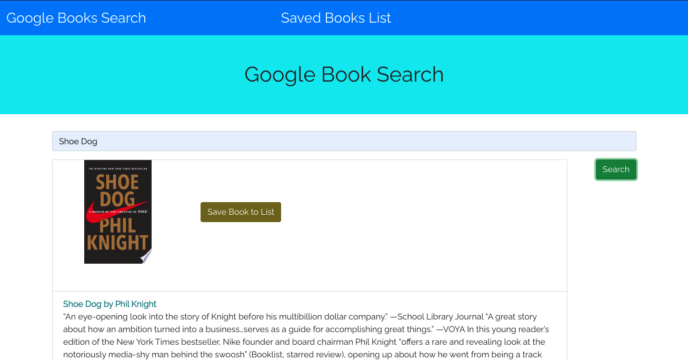
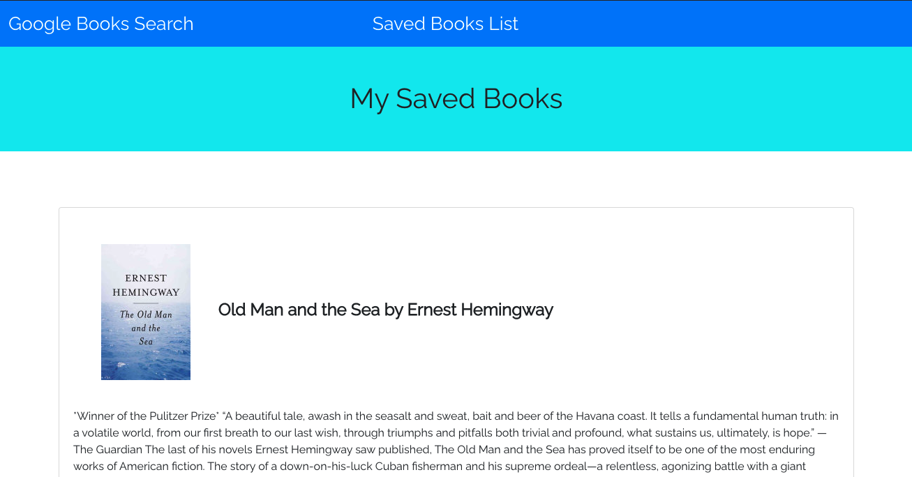

# Google-Books-Search

A React-based Google Books Search app using - [MERN](https://www.educative.io/edpresso/what-is-mern-stack).

## Table of Contents

- [Description](#description)
- [Installation](#installation)
- [Technologies Used](#technologies)
- [Contributions](#contributions)
- [Links](#link)
- [License](#License)

## Description:

A Google Book Search application to search the google books database and save books in a book list.

## Installation:

In the command line of the working directory, install the following NPM packages: axios, express, mongoose, react, react-bootstrap, react-dom, react-strip, uuid.

## Technologies:

- Enter a book title or author's name into the <strong>Google Book Search</strong> bar.
- The user can save the book to the <strong>Saved book List</strong>.
- To remove a book from your saved book list, click the <strong>Delete Icon</strong>.

## Contributions:

- [React.js](https://reactjs.org/)
- [Bootstrap](https://getbootstrap.com/)
- [Node.js](https://nodejs.org/en/)
- [Npm-Express](https://www.npmjs.com/package/express)
- [Javascript](https://www.javascript.com/)
- [HTML](https://developer.mozilla.org/en-US/docs/Web/HTML)
- [CSS](https://developer.mozilla.org/en-US/docs/Web/CSS)

## Links

Click here for the [Link](https://secure-springs-57437.herokuapp.com/)

Click here for [GitHub](https://github.com/10-kp/Google-Books-Search)

## License:

MIT
